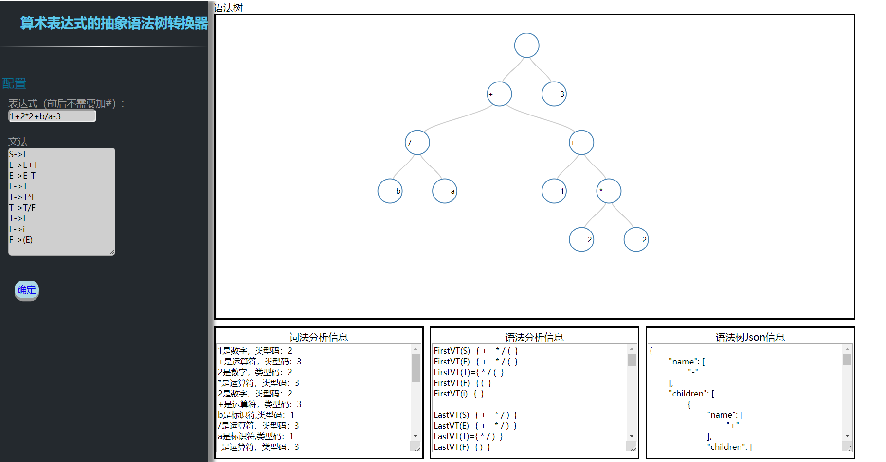

# arithmetic-expression-to-AST

将算术表达式转换成抽象语法树的JS程序实现。A program in JS can evaluate an arithmetic expression and convert it to abstract syntax tree.

结果输出：

- 语法树的可视化数据
- 语法树的json数据
- 词法分析信息
- 语法分析信息

You can [click here to play!](https://getianao.github.io/arithmetic-expression-to-AST/)

## 说明

对输入表达式和进行了**词法分析**和**语法分析**：

词法分析可识别：

- 标识符：为首字符为字母的字母数字序列
- 数字串：由`0123456789`组成的整数。
- 运算符：包括`+-*/()`。
- 其余为非法字符

语法分析采用通过栈实现的算符优先分析法。

语法树的可视化部分通过[D3.js](<https://d3js.org/>)实现。

## 截图



## LICENSE

```
Copyright 2019 getianao

Licensed under the Apache License, Version 2.0 (the "License"); you may not use this file except in compliance with the License. You may obtain a copy of the License at

http://www.apache.org/licenses/LICENSE-2.0

Unless required by applicable law or agreed to in writing, software distributed under the License is distributed on an "AS IS" BASIS, WITHOUT WARRANTIES OR CONDITIONS OF ANY KIND, either express or implied. See the License for the specific language governing permissions and limitations under the License.
```

